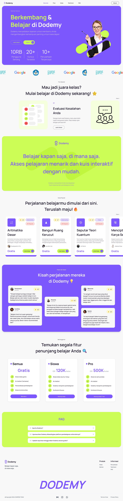
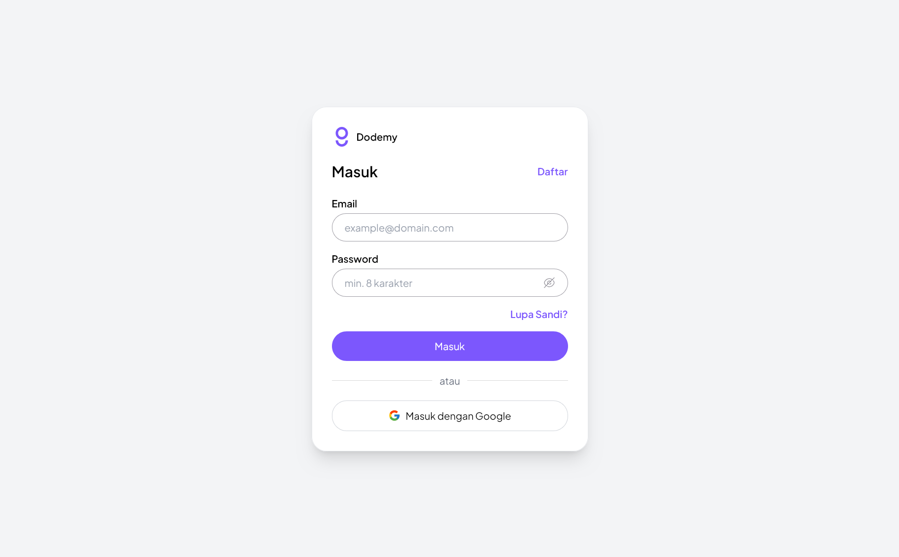
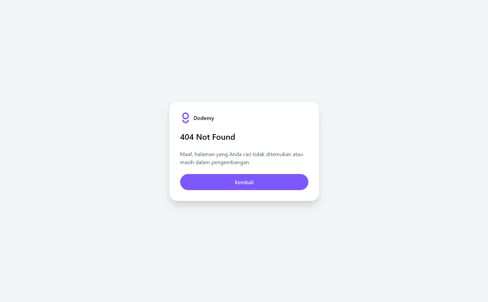
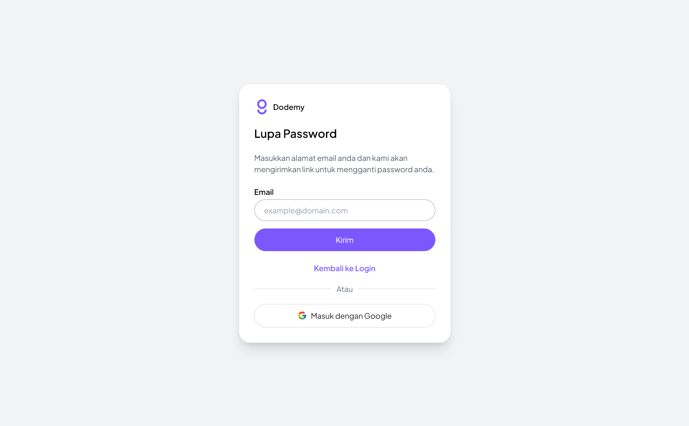
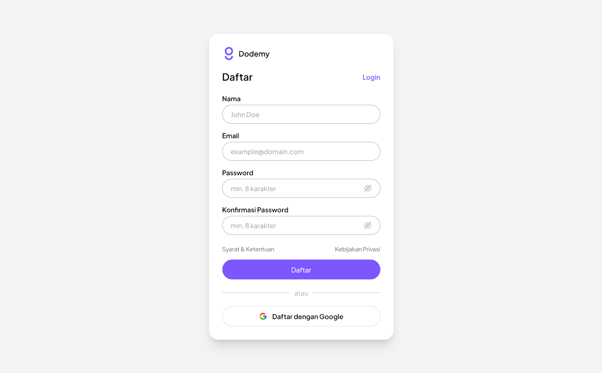

# Dodemy

Dodemy! "Everywhere and Anytime” is a LMS (Learning Management System) that we (3 Person with a 1 Mentor) build to competiting in INVENTION UDAYANA 2024

## Authors

- [@jhokam](https://github.com/jhokam)
- [@hnifalii](https://github.com/hnifalii)
- [@mooooimo](https://instagram.com/mooooimo) Instagram

## Demo

<https://dodemy.vercel.app/>

## Tech Stack

HTML, CSS, TailwindCSS (CDN), Javascript

## Route

`/`
`/404.html`
`/dashboard`
`/auth/register.html`
`/auth/login.html`
`/auth/forgot-password.html`

## Run Locally

> We recommended you to using Live Server for running local

Clone the project

```bash
  git clone https://github.com/jhokam/Dodemy
```

Go to the project directory

```bash
  cd Dodemy
```

Start the live server

> Using Live Server extension

## Screenshots










